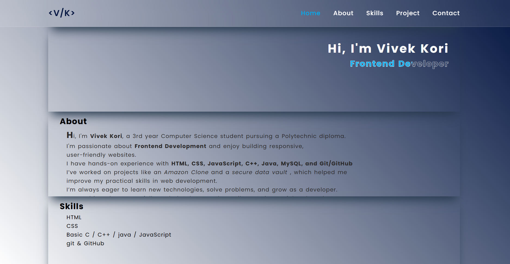
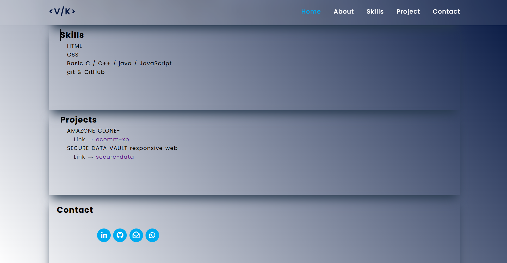
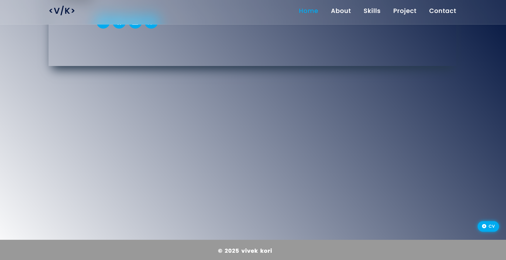
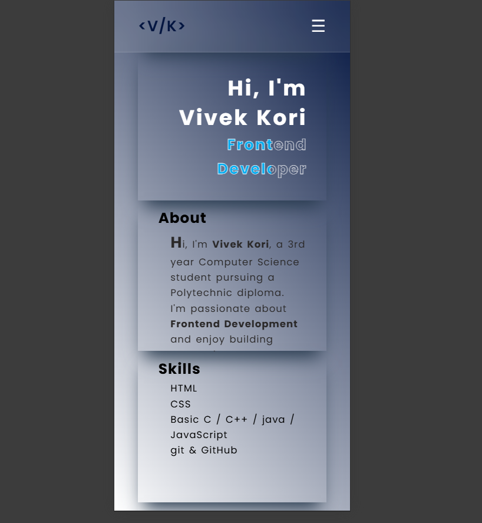

# 🌐 Vivek Kori | Portfolio

This is my personal portfolio website showcasing my skills, projects, and contact details.  
Built using **HTML, CSS**.
💡 Note: This portfolio is fully responsive and works seamlessly on mobile devices.

## 🚀 Live Demo
👉 [View Portfolio](https://your-username.github.io/vivek-portfolio/)

## 🛠️ Tech Stack
- HTML5
- CSS3
- Git & GitHub

## 📂 Projects Highlighted
- [Amazon Clone](https://ecomm-xp.netlify.app/)
- [Secure Data Vault](https://secure-data.netlify.app/)

## 📸 Preview  

### Homepage / About Section  

### Skills / Project Section / contact section

### footer Section  

### Mobile Preview 

## Live Preview

🔗 [View Live Portfolio](https://vivek-portfolio01.netlify.app/)

## 📬 Contact
- LinkedIn: [vivek-kori-v8](https://www.linkedin.com/in/vivek-kori-v8)
- GitHub: [vivekk-coder](https://github.com/vivekk-coder)
- Email: [vivekkori64@email.com](mailto:vivekkori64@email.com)
